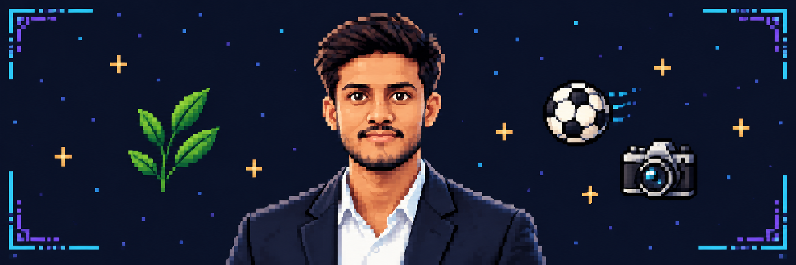
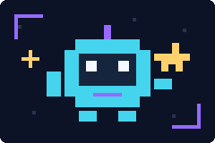

  

<h1 align="center">Rana Umar Bilal</h1>

<strong>Builder of things that matter.</strong>

  

  

  <strong>SELECT A QUEST</strong> 
  <a href="#featured-quests">🎮 Projects</a> &nbsp; · &nbsp;
  <a href="#tech-stack">🧰 Tech Stack</a> &nbsp; · &nbsp;
  <a href="#bonus-level">✨ Bonus</a>

---

Welcome to my little corner of GitHub. My projects explore how AI and software can turn an idea into something you can try—from identifying a leaf to building a football squad or making a cloak disappear on camera.

## Featured quests

Choose a project below to reveal its mission, toolkit, and launch controls.

<strong>🌿 QUEST 01 · Leaf-ID — Identify your next discovery</strong>

### A little plant knowledge, powered by computer vision.

A leaf-recognition app built with PyTorch and Streamlit, using EfficientNet-B0 to identify plant species and flag disease for supported classes.

**Your mission:** Open the demo, upload a leaf photo, and explore its prediction.

`Python` `PyTorch` `Streamlit`

 

<strong>⚽ QUEST 02 · Either Football or Soccer — Take the manager's seat</strong>

### Pick your squad. Test your tactics. Debate the name.

An AI-assisted squad builder and match simulator with player scouting, tactical controls, and AI-generated match analysis.

**Your mission:** Build a squad, adjust your tactics, and simulate a match.

`TypeScript` `React` `Node.js`

 

<strong>📷 QUEST 03 · Magic-Camera — Try a little browser magic</strong>

### An invisibility cloak, right in your browser.

A camera experiment that uses color detection to create a live invisibility effect. Camera processing stays on your device.

**Your mission:** Start the camera, capture the background, and try the effect with a solid-colored cloth.

`JavaScript` `HTML` `CSS`

 

<strong>🗺️ Side quests — cloud systems &amp; data</strong>

 

- **[Cloud-logs-Analyzer](https://github.com/ranaumarbilal31/Cloud-logs-Analyzer)** — A Flask app for analyzing server logs with a Python MapReduce pipeline and PostgreSQL storage.
- **[BIG-DATA-ANALYTICS](https://github.com/ranaumarbilal31/BIG-DATA-ANALYTICS)** — Coursework and practical experiments in data preprocessing, analytics, visualization, and big-data tools.

## Tech Stack

Technologies I've used across my projects:

### Web development

    

### ML & computer vision

  

### Backend & data

  

<strong>📋 Read the stack &amp; credentials</strong>

- **Web:** JavaScript, TypeScript, React, HTML, CSS.
- **ML & computer vision:** Python, PyTorch, Streamlit.
- **Backend & data:** Node.js, Flask, PostgreSQL.
- **Credential:** Google Certified Data Analyst.

## Bonus level

<strong>🪙 Unlock bonus</strong>

  

<strong>Achievement unlocked: Curious human.</strong> You found the secret room. Your reward: one imaginary gold star. ⭐

---

Thanks for stopping by. Pick a quest, explore the code, and make yourself at home. <a href="https://github.com/ranaumarbilal31?tab=repositories">Browse all repositories →</a>

